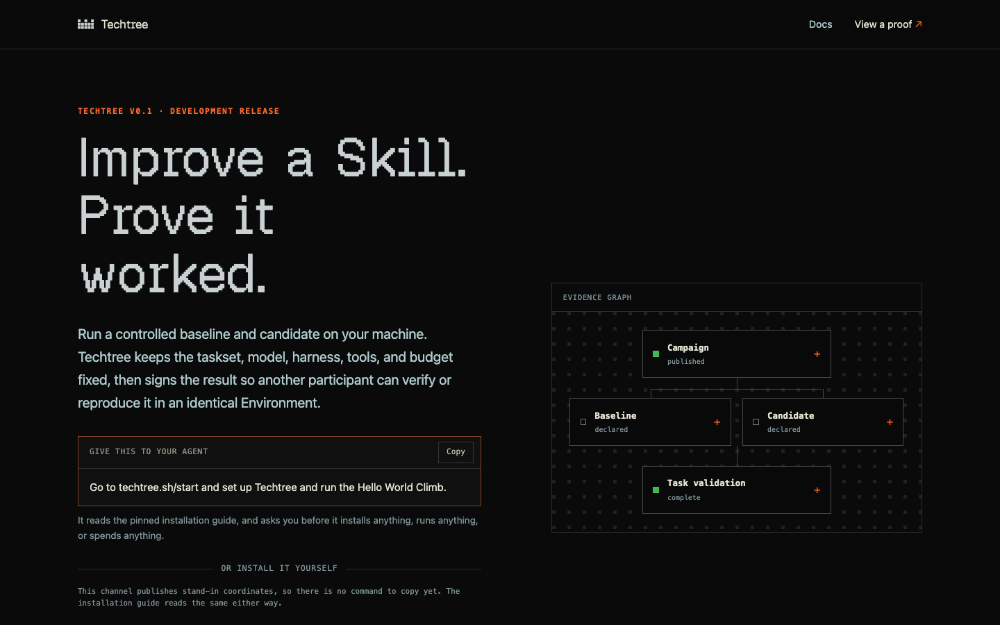

# Techtree Platform

[](LICENSE) [](https://elixir-lang.org/) [](https://www.phoenixframework.org/)



*The front page this application serves at `/`.*

The public surface for Techtree Climb: an onboarding and bootstrap registry, a
catalog of the public Climbs and the protocol objects they are built from, and
the append-only log of the runs participants have published.

> [!IMPORTANT]
> Techtree Climb v0.1 is a working technical preview of a stack of three independent
> parts: Prime Intellect's Verifiers as the evaluation engine,
> Nous Research's Hermes as the agent host, and
> Techtree as the campaign kernel and evidence layer.
> What it demonstrates is that the three pin together tightly enough for a
> controlled comparison to run end to end and leave a receipt that verifies
> offline.

```text
        you
         │  one pasted prompt
         ▼
   Hermes (operator) ······ techtree-hermes
         │  fixed argv · one JSON envelope
         ▼
   Techtree CLI ··········· techtree-python
         │  pinned engine, detached runs
         ▼
   Verifiers evaluation ··· (Prime Intellect, pinned to an exact commit)
         │  model calls, paid by the participant
         ▼
   subject: hermes-agent + pinned model, in a pinned container
         │
         ▼
   signed report · proof that verifies offline

   techtree-ash ─ the site: pinned guide, catalog, published objects, Results   ◀ this repository
```

## The other two repositories

- **[techtree-python](https://github.com/regents-ai/techtree-python)** — the
  Techtree CLI and evaluation substrate: campaigns, detached runs, signed
  comparison reports, and offline proof verification. Everything a comparison
  measures and records happens there, on the participant's own machine.
- **[techtree-hermes](https://github.com/regents-ai/techtree-hermes)** — the
  Hermes plugin that gives that CLI a conversational operator: it explains,
  prepares, asks for approval, and relays results. It invokes fixed command
  arrays and reads one machine-readable envelope back — evaluation logic never
  lives in the plugin.

The evaluation engine, the agent host, and the container the subject runs in
are each pinned to an exact version, and the release is only as reproducible as
those pins. Those are the seams of the stack, and this site says so rather than
letting a reader find them.

| Layer | What | Pin |
| --- | --- | --- |
| Evaluation engine | Prime Intellect's Verifiers | pinned to an exact commit |
| Agent host | Nous Research's Hermes, the operator | host Hermes 0.20.1 or newer |
| Evaluated subject | hermes-agent, in a pinned container | 0.19.0 |
| Subject model | qwen/qwen3.7-flash, reached through prime | named by the Campaign |
| Campaign kernel and evidence | the Techtree CLI | Python 3.12, managed with uv |

> [!NOTE]
> This application does not run evaluations, accept Skills, store Episodes or
> Traces, authenticate anyone, or run a leaderboard. It accepts one thing: a
> signed proof a participant chose to publish, and the signed withdrawal of one
> they published earlier. Results are ordered by arrival and never ranked.
> The local scientific loop in `techtree-python` keeps working when
> this site is offline — the site is discovery, onboarding and the log, never a
> runtime dependency.

## What is implemented so far

All of it: the catalog kernel, the public API over it, and the pages.

```text
lib/techtree/catalog/
├── domain.ex            Techtree.Catalog — resources, code interfaces, config
├── catalog_entry.ex     one searchable row per shipped object
├── catalog_release.ex   one import attempt and what came of it
├── bootstrap_release.ex the published install contract, as exact bytes
├── bundle.ex            a generated export on disk, and safe path resolution
├── digest.ex            sha256 over raw bytes; no canonicalization
├── verifier.ex          digests, paths, index shape, bootstrap shape, no dangling refs
├── importer.ex          verify, stage, activate — all of it or none of it
└── query.ex             the only read path the web surface may call
```

## The published surface

```text
GET /                           what Techtree Climb is
GET /start                      the two supported ways to run a Climb
GET /climbs                     the Climbs this release offers
GET /climbs/:slug               one Climb in full
GET /proofs/local               what a locally produced result claims
GET /protocol                   the documents a trial is made of
GET /results                    published Results, newest first
GET /results/:bundle_digest     one published Result in full

GET /healthz                    is a catalog being served, and which one
GET /api/v1/bootstrap           the installation contract, exact bytes
GET /api/v1/catalog             the generated catalog index, exact bytes
GET /api/v1/climbs/:slug        one Climb summarized, with links to its objects
GET /api/v1/objects/:digest     one protocol object, exact bytes
GET /api/v1/publications        the run log, newest first
GET /api/v1/publications/:digest  one published run
GET /api/v1/publication-keys/:key_id  the public half of this site's own key

POST /api/v1/publications       a signed publication, or a signed withdrawal
```

All but one route is a read. The exception is the single write address decision
0038 allows: it takes a signed proof a participant chose to publish, or the
signed withdrawal of one they published before, and the two are told apart by a
member each document's own signature covers. There is no route that uploads a
file, authenticates anybody, or ranks anything, and no second write may be
added.

Caching follows how immutable each address is. A content-addressed object may be
kept forever; the catalog index and the installation contract are cached briefly
and revalidated against their digest, and both honour `If-None-Match`.

Refusals share one shape — a stable code, a message that is safe to show a
stranger, and whether retrying could help:

```text
400  the digest in the path is not a digest
404  the digest or slug names nothing this release ships
503  nothing is imported yet, or the stored bytes no longer match their digest
```

The last one is deliberate: bytes that do not match the digest they are filed
under are never served, under any status.

### The installation contract

`/api/v1/bootstrap` publishes the pinned installation path: the minimum host
Hermes version, the exact CLI version, the plugin repository and its full
immutable commit, and the introductory Climb. Every executable instruction is an
array of arguments. Nothing in the payload is a shell string, nothing in it is a
credential, and the server never runs any of it.

Until the real release coordinates are signed off, the shipped contract is a
placeholder and says so in the payload itself: `placeholder_release` is `true`,
the versions read `0.0.0-placeholder`, and the pinned commits are all zeroes, so
an instruction that escaped review would fail rather than install the wrong
thing. Every bootstrap document must state `placeholder_release` either way — a
release that forgot to say would be read as real.

## Exact bytes

Protocol objects are served byte-for-byte as `techtree-python` generated them.
They are never decoded and re-encoded here: an alternate JSON serialization
would be an alternate scientific representation with a different digest. The
database holds projections and release state; the bytes stay in the bundle and
are hashed again on every read.

## The catalog bundle

`priv/catalog` holds the generated export and is not under version control in
this repository — the Python repository is the single owner of those artifacts.
Sync one in before importing:

```bash
mix run --no-start scripts/sync_catalog.exs \
  --source ../techtree-python/src/techtree/resources/catalog \
  --source-revision <full-commit> \
  --generator-version <generator-version> \
  --bootstrap priv/bootstrap/development.json
```

`--source-revision`, `--generator-version`, and the bootstrap document are
release inputs, supplied explicitly rather than guessed: the pinned CLI version
and the pinned Hermes plugin commit are founder-owned decisions.

`priv/bootstrap` holds one declared placeholder per release channel:
`development.json` for local work, and `stable.json`, the release the `stable`
channel is rolled back onto. Both are non-installable by construction. The
release with real coordinates lives in `priv/releases/climb-v0.1.0/` and is not
served by this build.

Then verify and import:

```bash
mix catalog.verify --path priv/catalog
mix catalog.import --path priv/catalog
```

Both exit nonzero on failure. A failed import leaves the previously active
release serving exactly what it was serving.

## The pages

Plain documents: a serif measure of about 40 characters wide, three type sizes,
high contrast in both light and dark, no animation, and a print stylesheet. The
markup is semantic and the stylesheet is hand-written CSS with no framework and
no remote fonts, so a page is readable on a phone, in a reader, and on paper.

Every page renders completely on the first response; the live connection only
keeps it current. Nothing on the site collects anything about a reader.

Copy follows one rule: say what something means for the person reading it. The
protocol page is written for a technical reader and names documents the way the
protocol names them; everywhere else, a fingerprint is a fingerprint.

## Development

Requires PostgreSQL 14 or newer.

```bash
mix setup   # deps, database, assets
mix check   # formatting, warnings-as-errors, tests
```

`PGUSER`, `PGPASSWORD`, and `PGHOST` override the development and test database
connection when the local server does not use the Phoenix defaults.

## Runtime configuration

| Variable | What it is for |
| --- | --- |
| `DATABASE_URL` | required in production |
| `SECRET_KEY_BASE` | required in production |
| `PHX_HOST`, `PORT` | endpoint |
| `TECHTREE_CATALOG_ROOT` | a bundle deployed beside the release, optional |
| `TECHTREE_BOOTSTRAP_CHANNEL` | the release channel to import and serve; `development` unless set, `stable` in production |

No model-provider credential is read by this application.
